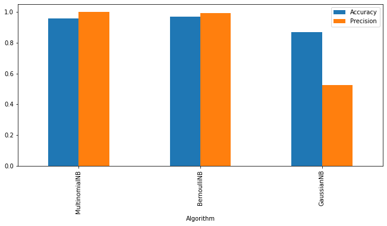

# SMS_Classfier
__The spam detection app__ that I built is a machine learning application developed in Python. 
The main aim of the app is to classify a given message as spam or not-spam. To achieve this goal, I used the __Multinomial Naive Bayes__ algorithm from the scikit-learn library. 
The algorithm is part of a family of Bayesian algorithms and uses __Bayes' theorem__ to make predictions.

Before fitting the data into the algorithm, I preprocessed the text using the __Natural Language Toolkit (NLTK)__ library to clean up the dataset.
The text data was obtained from __Kaggle__, a popular online platform for machine learning and data science competitions.
Preprocessing the text data improved the accuracy of the algorithm, as it helped to remove any irrelevant information and noise from the dataset.

__Link to Kaggle Dataset:__  https://www.kaggle.com/uciml/sms-spam-collection-dataset

For the frontend of the app, I used the __Streamlit__ library. __Streamlit__ is a modern, easy-to-use framework for building machine learning and data science applications. It allowed me to create a user-friendly interface for the app, making it accessible and usable by a wider audience.

Finally, I deployed the app on __Streamit Sharing__.
It's important to note that the app is not 100% accurate. Using the Multinomial Naive Bayes algorithm, the app has an accuracy of 95%. This means that while the app is quite effective in detecting spam messages, there is still some room for improvement. Nevertheless, the use of the Multinomial Naive Bayes algorithm, combined with preprocessed text data, Streamlit, and Streamlit Sharing, make this app a "powerful" tool for identifying spam messages.

__Link to the app:__  https://sashuv-sms-classfier-main-m29j69.streamlit.app/

In conclusion, the spam detection app that I built uses the Multinomial Naive Bayes algorithm, preprocessed text data, Streamlit to classify messages as spam or not-spam. The choice of the Multinomial Naive Bayes algorithm was made due to its higher precision compared to the other two algorithms tried, Gaussian Naive Bayes and Bernoulli Naive Bayes.

